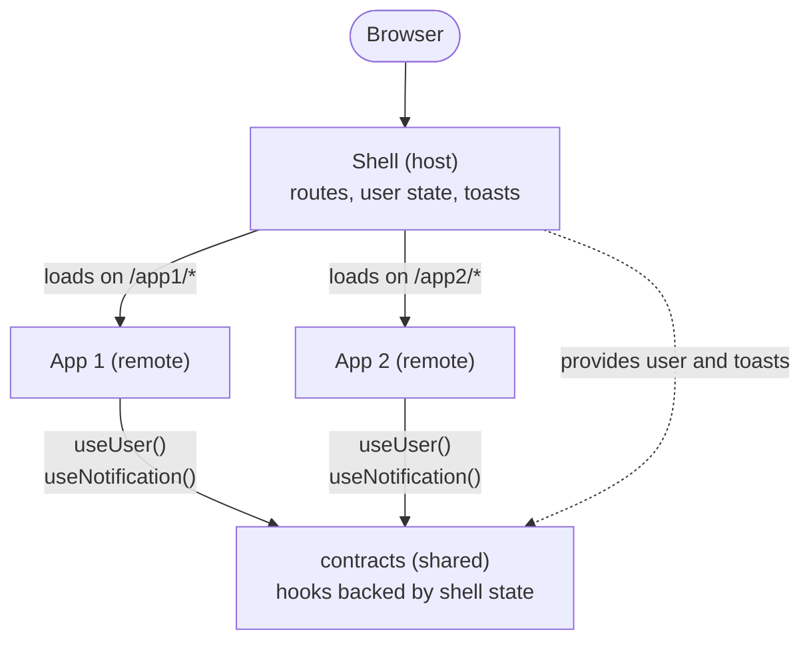

# Module Federation PoC

Micro frontends with React, TypeScript, Vite and Module Federation. A shell application loads two separately built apps at runtime, based on the URL.

## Architecture

## How it works

- The shell lazy-loads each sub app with `import("app1/App")` when its route is visited.
- React, React Router and `contracts` are shared as singletons, so all apps use one copy.
- Sub apps use hooks `useUser()` and `useNotification()`. Their state lives in the shell, so every app sees the same user and toasts, and none of them has to implement that logic itself.
- If a sub app fails to load, the shell shows a fallback with a Retry button.

